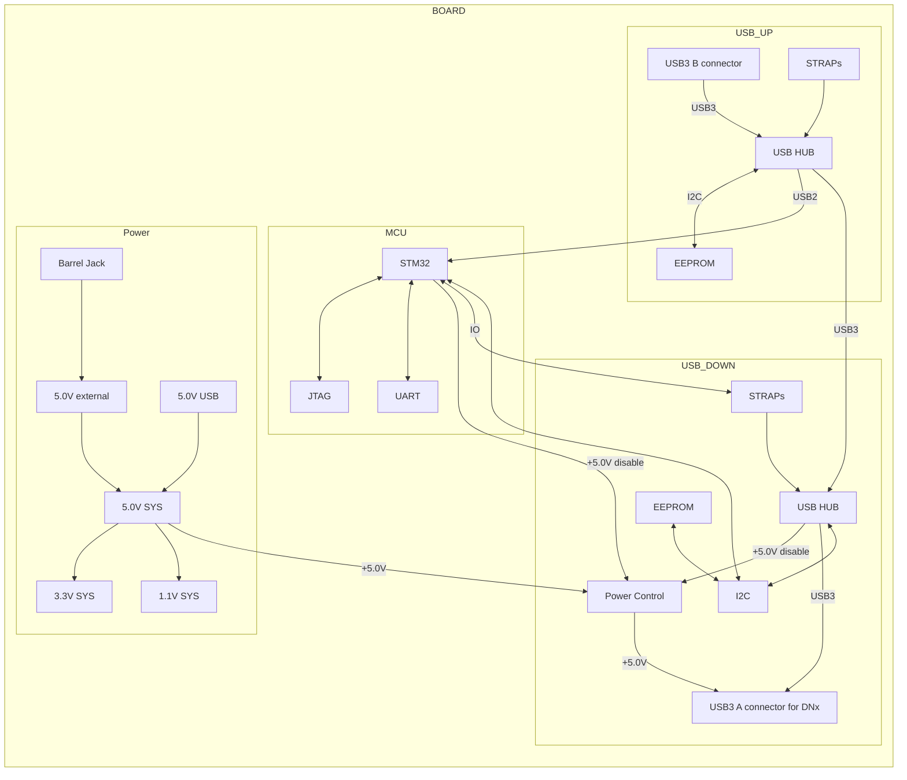

```mermaid
flowchart LR
    subgraph BOARD
        subgraph Power
            BARREL_JACK[Barrel Jack]
            5V_EXT[5.0V external]
            5V_USB_UP[5.0V USB]
            5V_SYS[5.0V SYS]
            3V3_SYS[3.3V SYS]
            1V1_SYS[1.1V SYS]

            BARREL_JACK --> 5V_EXT
            5V_USB_UP --> 5V_SYS
            5V_EXT --> 5V_SYS
            5V_SYS --> 3V3_SYS
            5V_SYS --> 1V1_SYS
        end
        subgraph MCU
            STM32
            JTAG
            UART

            STM32 <--> JTAG
            STM32 <--> UART

        end
        subgraph USB_UP
            HUB_2DN[USB HUB]
            EEPROM_UP[EEPROM]
            STRAPS_UP[STRAPs]
            USB3B_CONN[USB3 B connector]

            USB3B_CONN -- "USB3" --> HUB_2DN
            STRAPS_UP --> HUB_2DN
            HUB_2DN <-- "I2C" --> EEPROM_UP
        end
        subgraph USB_DOWN
            HUB_4DN[USB HUB]
            EEPROM_DOWN[EEPROM]
            STRAPS_DOWN[STRAPs]
            POWER_CTRL[Power Control]
            USB3A_CONN_DNx[USB3 A connector for DNx]
            I2C

            POWER_CTRL -- "+5.0V" --> USB3A_CONN_DNx
            HUB_4DN -- "+5.0V disable" --> POWER_CTRL
            HUB_4DN -- "USB3" --> USB3A_CONN_DNx
            STRAPS_DOWN --> HUB_4DN
            HUB_4DN <--> I2C
            EEPROM_DOWN <--> I2C
        end

        %% Power
        5V_SYS -- "+5.0V" --> POWER_CTRL
        STM32 -- "+5.0V disable" --> POWER_CTRL

        %% USB signals
        HUB_2DN -- "USB2" --> STM32
        HUB_2DN -- "USB3" --> HUB_4DN

        %% USB HUB downstream management
        STM32 <-- "IO" --> STRAPS_DOWN
        STM32 <--> I2C


    end
```
