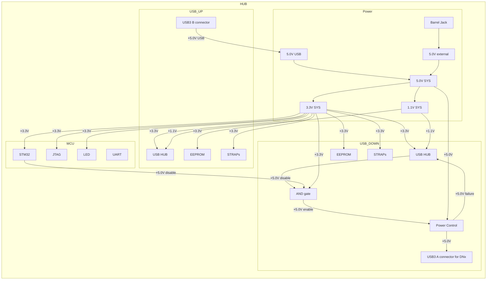

```mermaid
flowchart LR
    subgraph HUB
        subgraph Power
            BARREL_JACK[Barrel Jack]
            5V_EXT[5.0V external]
            5V_USB_UP[5.0V USB]
            5V_SYS[5.0V SYS]
            3V3_SYS[3.3V SYS]
            1V1_SYS[1.1V SYS]

            BARREL_JACK --> 5V_EXT
            5V_USB_UP --> 5V_SYS
            5V_EXT --> 5V_SYS
            5V_SYS --> 3V3_SYS
            5V_SYS --> 1V1_SYS
        end
        subgraph MCU
            STM32
            JTAG
            UART
            LED

        end
        subgraph USB_UP
            HUB_2DN[USB HUB]
            EEPROM_UP[EEPROM]
            STRAPS_UP[STRAPs]
            USB3B_CONN[USB3 B connector]
        end
        subgraph USB_DOWN
            HUB_4DN[USB HUB]
            EEPROM_DOWN[EEPROM]
            STRAPS_DOWN[STRAPs]
            POWER_CTRL[Power Control]
            USB3A_CONN_DNx[USB3 A connector for DNx]
            AND_GATE[AND gate]

            HUB_4DN -- "+5.0V disable" --> AND_GATE
            AND_GATE -- "+5.0V enable" --> POWER_CTRL
            POWER_CTRL -- "+5.0V failure" --> HUB_4DN
            POWER_CTRL -- "+5.0V" --> USB3A_CONN_DNx
        end

        %% Power
        USB3B_CONN -- "+5.0V USB" --> 5V_USB_UP
        5V_SYS -- "+5.0V" --> POWER_CTRL
        STM32 -- "+5.0V disable" --> AND_GATE
        3V3_SYS -- "+3.3V" --> STM32
        3V3_SYS -- "+3.3V" --> JTAG
        3V3_SYS -- "+3.3V" --> LED
        3V3_SYS -- "+3.3V" --> HUB_2DN
        3V3_SYS -- "+3.3V" --> EEPROM_UP
        3V3_SYS -- "+3.3V" --> STRAPS_UP
        3V3_SYS -- "+3.3V" --> HUB_4DN
        3V3_SYS -- "+3.3V" --> EEPROM_DOWN
        3V3_SYS -- "+3.3V" --> STRAPS_DOWN
        3V3_SYS -- "+3.3V" --> AND_GATE
        1V1_SYS -- "+1.1V" --> HUB_2DN
        1V1_SYS -- "+1.1V" --> HUB_4DN

    end
```
