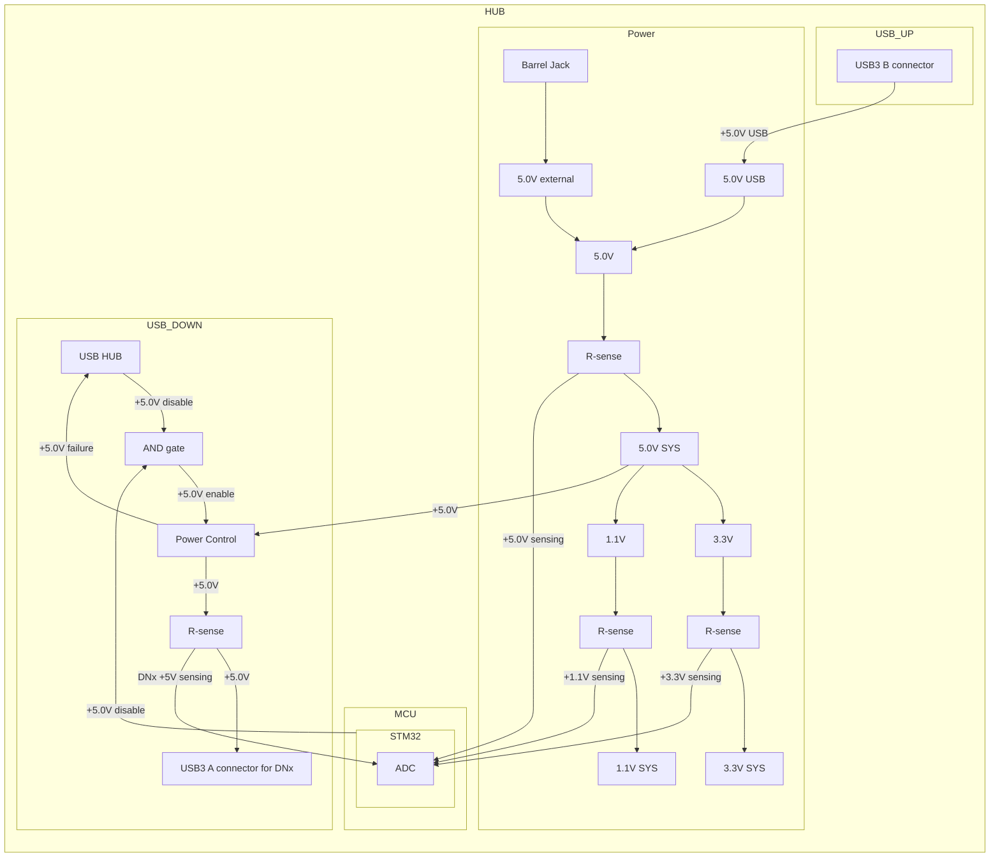

```mermaid
flowchart LR
    subgraph HUB
        subgraph Power
            BARREL_JACK[Barrel Jack]
            5V_EXT[5.0V external]
            5V_USB_UP[5.0V USB]
            5V_SYS[5.0V SYS]
            3V3_SYS[3.3V SYS]
            1V1_SYS[1.1V SYS]
            5V[5.0V]
            3V3[3.3V]
            1V1[1.1V]
            RSENSE_5V[R-sense]
            RSENSE_3V3[R-sense]
            RSENSE_1V1[R-sense]

            BARREL_JACK --> 5V_EXT
            5V_USB_UP --> 5V
            5V_EXT --> 5V
            5V --> RSENSE_5V
            RSENSE_5V --> 5V_SYS

            5V_SYS --> 3V3
            3V3 --> RSENSE_3V3
            RSENSE_3V3 --> 3V3_SYS

            5V_SYS --> 1V1
            1V1 --> RSENSE_1V1
            RSENSE_1V1 --> 1V1_SYS
        end
        subgraph MCU
            subgraph STM32
                ADC
            end
        end
        subgraph USB_UP
            USB3B_CONN[USB3 B connector]
        end
        subgraph USB_DOWN
            HUB_4DN[USB HUB]
            POWER_CTRL[Power Control]
            USB3A_CONN_DNx[USB3 A connector]
            AND_GATE[AND gate]
            RSENSE_5V_DNx[R-sense]

            HUB_4DN -- "+5.0V disable" --> AND_GATE
            AND_GATE -- "+5.0V enable" --> POWER_CTRL
            POWER_CTRL -- "+5.0V failure" --> HUB_4DN
            USB3A_CONN_DNx[USB3 A connector for DNx]

            POWER_CTRL -- "+5.0V" --> RSENSE_5V_DNx
            RSENSE_5V_DNx -- "+5.0V" --> USB3A_CONN_DNx
        end

        %% Power
        USB3B_CONN -- "+5.0V USB" --> 5V_USB_UP
        5V_SYS -- "+5.0V" --> POWER_CTRL
        STM32 -- "+5.0V disable" --> AND_GATE

        %% Power sensing
        RSENSE_5V -- "+5.0V sensing" --> ADC
        RSENSE_3V3 -- "+3.3V sensing" --> ADC
        RSENSE_1V1 -- "+1.1V sensing" --> ADC
        RSENSE_5V_DNx -- "DNx +5V sensing" --> ADC

    end
```
