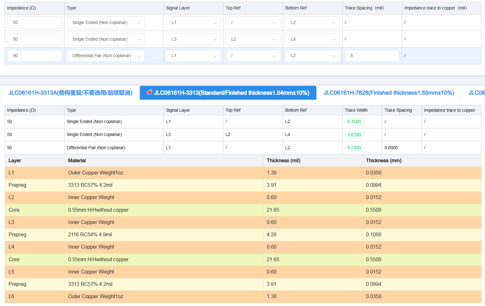

# USB HUB Project Hardware
USB HUB hardware project for USB HUB device.

## EDA
Project is prepared with KiCAD

### Version
Version: 8.0.5, release build

Libraries:
* wxWidgets 3.2.5
* FreeType 2.13.2
* HarfBuzz 9.0.0
* FontConfig 2.14.2
* libcurl/8.8.0-DEV Schannel zlib/1.3.1

Build Info:
* Date: Sep 7 2024 02:39:48
* wxWidgets: 3.2.5 (wchar_t,wx containers)
* Boost: 1.85.0
* OCC: 7.8.1
* Curl: 8.8.0-DEV
* ngspice: 42
* Compiler: Visual C++ 1939 without C++ ABI

## Components

* Main USB HUB: TUSB8041
    * package: VQFN-64
    * [details](https://www.ti.com/lit/ds/symlink/tusb8041.pdf)
* Additional USB HUB: TUSB8020B
    * package: HTQFP-48
    * [details](https://www.ti.com/lit/gpn/TUSB8020B)
* Microcontroller: STM32G441RBTx
    * package: LQFP-64
    * [details](https://www.st.com/en/microcontrollers-microprocessors/stm32g441kb.html)
* 3.3V VR: LDO 1117-3.3 (3.3V/1A) LDO
    * package: SOT-223
    * [details](https://www.st.com/resource/en/datasheet/ld1117.pdf)
* 1.1V VR: DC/DC Buck: TPS54531
    * package: 
    * [details](https://www.ti.com/lit/ds/slvsbi5/slvsbi5.pdf)
* Current-Sense Amplifier: INA180
    * package: SOT-23(5)
    * [details](https://www.ti.com/lit/ds/symlink/ina180.pdf)
* Current-limited power switch: TPS2561
    * package: VSON-10
    * [details](https://www.ti.com/lit/ds/symlink/tps2561.pdf)
* EEPROM: AT24C04
    * package: SOIC-8
    * [details](https://ww1.microchip.com/downloads/en/DeviceDoc/doc0180.pdf)
* Resistors: SMT, 0402 and 0603
* Current measure resistors: SMT, 0.5%, 1206
* Capacitors: SMT, 0603 and 0805
* Headers: 2.54mm
* USB connectors:
    * upstream: THT, USB 3.0 B
    * downstream: THT, USB 3.0 A
* External DC connector: 5.5/2.1mm barrel power jack
* LEDs: SMT
* Push-buttons: SMT

## Additional documents

* [User guide: TUSB8041RGC REVD Evaluation Module User's Guide](https://www.ti.com/lit/pdf/sllu198)
* [Design guide: 2-Port USB 3.0 Hub (TIDA-00287)](https://www.ti.com/lit/pdf/tidu428)
* [Application note: High-Speed Layout Guidelines for Signal Conditioners and USB Hubs](https://www.ti.com/lit/pdf/slla414)
* [Application note: Guidelines for oscillator design on STM8AF/AL/S and STM32 MCUs/MPUs](https://www.st.com/resource/en/application_note/an2867-guidelines-for-oscillator-design-on-stm8afals-and-stm32-mcusmpus-stmicroelectronics.pdf)
* [Application note: EMC design guide for STM8, STM32 and legacy MCUs](https://www.st.com/resource/en/application_note/an1709-emc-design-guide-for-stm8-stm32-and-legacy-mcus-stmicroelectronics.pdf)
* [Basics of power supply design for STM32 MCU](https://wiki.st.com/stm32mcu/wiki/Basics_of_power_supply_design_for_MCU)

## Current consumption
Power architecture details can be found [here](../arch/power.md). It shows power rails derivation and power rails topology.

Below is the list of all system power rails with details about how they are derived.

* 1.1V SYS:
    * 1.1V power rails used to supply the USB HUB ICs,
    * derived from 5.0V SYS,
* 3.3V SYS:
    * 3.3V power rails used to supply all the ICs on the board (MCU, USB HUB, EEPROM, current sense IC)
    * derived from 5.0V SYS,
* 5.0V DNx:
    * 5.0V power rails used to supply USB downstream ports
    * derived from 5.0V SYS,
* 5.0V SYS:
    * 5.0V power rail, the main one,
    * derived from 5.0V EXT (external +5.0V DC power supply) or host USB 3.0 upstream (up to 900mA\4.5W),

In the table below there is list of board's components along with their theoretical maximal power consumption.

USB HUB ICs are not included. See next paragraph for USB HUB ICs.

| Component         | 3.3V SYS |
| ----------------- | -------- |
| MCU               | 50mA     |
| EEPROM            | 5mA (x2) |
| Current Sense Amp | 8mA (x7) |
| LED               | 5mA (x8) |
| AND gate          | 1mA (x4) |
| Power Switch      | 1mA (x2) |
|                   |          |
| Total             | 162mA    |

It gives 162mA @ 3.3V SYS. 3.3V SYS is derived from 5.0 SYS using LDO so related power consumption @ 5.0V SYS is 162mA * 5.0V = **810mW**

USB HUB ICs power consumption depend on USB topology (number and type of USB device connected to the board). In the table below there is list of a few configurations along with theoretical maximal power consumption.

In the table below there is a power consumption done by USB HUB ICs at 1.1V SYS power rail.

| Configuration | 1.1V SYS                                | Power @ 1.1V SYS  |
| ------------- | --------------------------------------- | ----------------- |
| 4 SS          | 778mA (TUSB8041)   364mA (TUSB8020B) | 1256mW            |
| 3 SS          | 661mA (TUSB8041)   364mA (TUSB8020B) | 1128mW            |
| 2 SS          | 508mA (TUSB8041)   364mA (TUSB8020B) | 959mW             |
| 1 SS          | 366mA (TUSB8041)   364mA (TUSB8020B) | 803mW             |
| 4 HS          | 86mA (TUSB8041)   364mA (TUSB8020B)  | 495mW             |
| 1 SS          | 63mA (TUSB8041)   364mA (TUSB8020B)  | 479mW             |
| 2 SS + 2 HS   | 554mA (TUSB8041)   364mA (TUSB8020B) | 1010mW            |
| 1 SS + 1 HS   | 395mA (TUSB8041)   364mA (TUSB8020B) | 835mW             |

In the table below there is a power consumption done by USB HUB ICs at 3.3V SYS power rail.

| Configuration | 3.3V SYS                                | Power @ 3.3V SYS  |
| ------------- | --------------------------------------- | ----------------- |
| 4 SS          | 49mA (TUSB8041)   93mA (TUSB8020B)   | 469mW             |
| 3 SS          | 49mA (TUSB8041)   93mA (TUSB8020B)   | 469mW             |
| 2 SS          | 49mA (TUSB8041)   93mA (TUSB8020B)   | 469mW             |
| 1 SS          | 49mA (TUSB8041)   93mA (TUSB8020B)   | 469mW             |
| 4 HS          | 76mA (TUSB8041)   93mA (TUSB8020B)   | 558mW             |
| 1 SS          | 45mA (TUSB8041)   93mA (TUSB8020B)   | 455mW             |
| 2 SS + 2 HS   | 99mA (TUSB8041)   93mA (TUSB8020B)   | 634mW             |
| 1 SS + 1 HS   | 85mA (TUSB8041)   93mA (TUSB8020B)   | 588mW             |

In the table below there is a power consumption done by USB downstream devices at 5.0V SYS power rail.

| Configuration | 5.0V DNx                                | Power @ 5V SYS DN |
| ------------- | --------------------------------------- | ----------------- |
| 4 SS          | 4 x 900mA                               | 18W               |
| 3 SS          | 3 x 900mA                               | 13.5W             |
| 2 SS          | 2 x 900mA                               | 9W                |
| 1 SS          | 1 x 900mA                               | 4.5W              |
| 4 HS          | 4 x 500mA                               | 10W               |
| 1 SS          | 1 x 500mA                               | 2.5W              |
| 2 SS + 2 HS   | 2 x 900mA + 2 x 500mA                   | 14W               |
| 1 SS + 1 HS   | 1 x 900mA + 1 x 500mA                   | 7W                |

In the table below there is a total power consumption done by USB HUB ICs and USB downstream devices.
Values below includes power loss during DC/DC conversion. Following rules used:

* 5.0V SYS -> 1.1V SYS conversion efficiency: 90% (step-down converter used, taken from TPS54531 specification)
* 5.0V SYS -> 3.3V SYS conversion efficiency: 66% (LDO used, =3.3/5.0)
* 5.0V SYS -> 5.0V DNx conversion efficiency: 100% (no DC/DC conversion)

| Configuration | 1.1V SYS -> 5.0V SYS    | 3.3V SYS -> 5.0V SYS    | 5.0V SYS DN -> 5.0V SYS | Total at 5.0V SYS |
| ------------- | ----------------------- | ----------------------- | ----------------------- | ----------------- |
| 4 SS          | 1256 / 0.9 = 1396mW     | 469 / 0.66 = 711mW      | 18W                     | 20.107W           |
| 3 SS          | 1128 / 0.9 = 1253mW     | 469 / 0.66 = 711mW      | 13.5W                   | 15.339W           |
| 2 SS          | 959  / 0.9 = 1066mW     | 469 / 0.66 = 711mW      | 9W                      | 10.777W           |
| 1 SS          | 803  / 0.9 = 892mW      | 469 / 0.66 = 711mW      | 4.5W                    | 6.103W            |
| 4 HS          | 495  / 0.9 = 550mW      | 558 / 0.66 = 845mW      | 10W                     | 11.345W           |
| 1 HS          | 479  / 0.9 = 532mW      | 455 / 0.66 = 689mW      | 2.5W                    | 3.721W            |
| 2 SS + 2 HS   | 1010 / 0.9 = 1122mW     | 634 / 0.66 = 961mW      | 14W                     | 16.083W           |
| 1 SS + 1 HS   | 835  / 0.9 = 928mW      | 588 / 0.66 = 891mW      | 7W                      | 8.819W            |

Conclusions:

* Total theoretical maximal power consumption (@ 5.0V SYS) is: 0.81 + 20.107 = **20.817W**
* Supplying from USB 3.0 upstream port would be enough to satisfy USB configuration with single USB HS device available only
* When more than one USB downstream ports are populated or having at least one USB SS device available - external power supply is required (minimum 5V/20W)

## PCB

### Vendor
[JLCPCB](https://jlcpcb.com)

### Details
* Material: FR4-TG155, JLC06161H-3313: [details](https://jlcpcb.com/help/article/User-Guide-to-the-JLCPCB-Impedance-Calculator)
* Layers count: 6 (L1.Signal, L2.GND, L3.Signal, L4.VCC, L5.GND, L6.Signal)
* PCB Thickness: 1.54mm (-/+ 10%)
* Prepreg: 3313 RC57%
* PCB stackup: 
    * [source](https://jlcpcb.com/pcb-impedance-calculator)
* Via hole:
  * 12mils (0.3mm) for signals
  * 15mils (0.38mm) for power 1
  * 20mils (0.5mm) for power 2
* Via diameter:
  * 30mils (0.64mm) for signals
  * 35mils (0.89mm) for power 1
  * 45mils (1.00mm) for power 2
* Via annular ring:
  * 9mils (0.23mm) for signal
  * 10mils (0.25mm) for power 1
  * 15mils (0.38mm) for power 2
* Silkscreen: 30mils x 30mils x 6mils

More details about JLCPCB capabilities can be found [here](https://jlcpcb.com/capabilities/pcb-capabilities)

## Design
### Version 1.00
[SCH](doc/usb-hub_sch_v1p00.pdf)

[PCB](doc/usb-hub_pcb_v1p00.pdf)

[GERBERS](gerbers/gerbers_v1p00.zip)

[BOM](bom.csv)

BOARD:

## Tests
TBD

